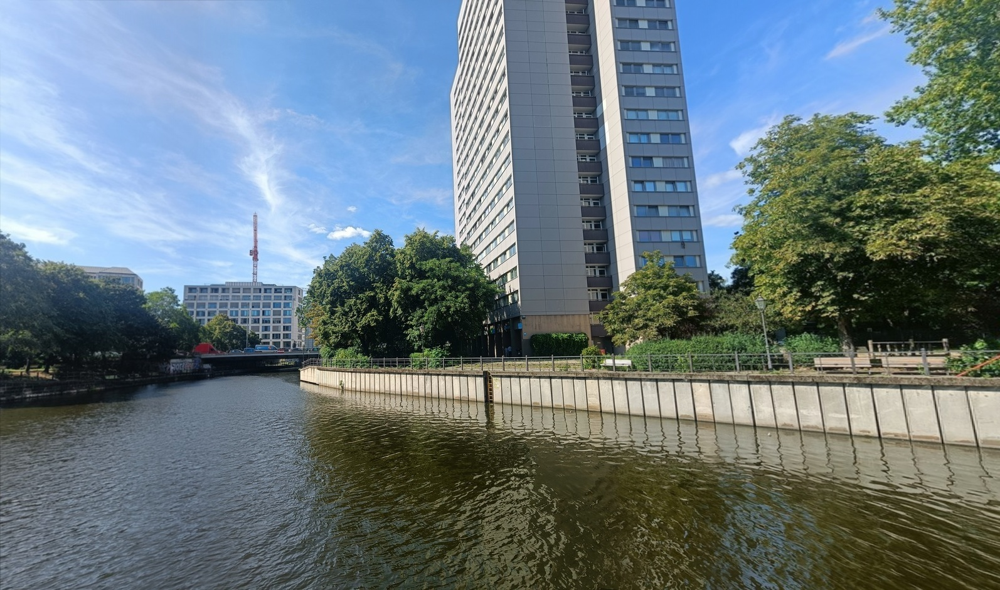

## Image Stitching

[](https://app.codacy.com/gh/arghadeep25/Image-Stitching/dashboard?utm_source=gh&utm_medium=referral&utm_content=&utm_campaign=Badge_grade)


### Description:

#### Sample Data (Berlin)
<p align="center">
   
    
  
    
   
    
</p> 

#### Results
<p align="center">
  
</p>

### Build
```
git clone git@github.com:arghadeep25/Image-Stitching.git
cmake -S . -B build && cmake --build build -j$(nproc)
```

### Usage
```
./image_stitching -i <input_path> -o <output_path>
```
Example
```
./image_stitching -i ../data/berlin/ -o ../results/berlin.jpg
```
### Dependencies
 - OpenCV >= 4.5.1
 - C++ 17

### Methodology:
- #### Feature Extraction
    - Detect features from all the images.
    - Compute descriptors for each keypoint

- #### Feature Matching
    - Match features between all the images using a k-d tree to find the k-nearest neighbors in feature space.
    - Use a distance metric to determine the similarity between two descriptors.
    - Use a ratio test to determine the best matches.

- #### Image Matching
    - Use RANSAC to estimate the homography between two images.
    - Use the homography to warp the images.
    - Blend the images together.
    - Probabilistic Model

- #### Panorama Recognition
    - Connected Components

- #### Image Alignment
    - Homography Estimation
    - RANSAC
    - Image Warping
    - Image Blending

- #### Rendering
    - Automatic Straightening
    - Gain Compensation
    - Multi-band Blending

### Research Paper:

[Automatic Panoramic Image Stitching using Invariant Features](https://www.cs.ubc.ca/~lowe/papers/07brown.pdf)

### Additional Links:

- [OpenCV Image Stitching Description](https://docs.opencv.org/3.4/d1/d46/group__stitching.html)
- [PyImageSearch](https://pyimagesearch.com/2018/12/17/image-stitching-with-opencv-and-python/)