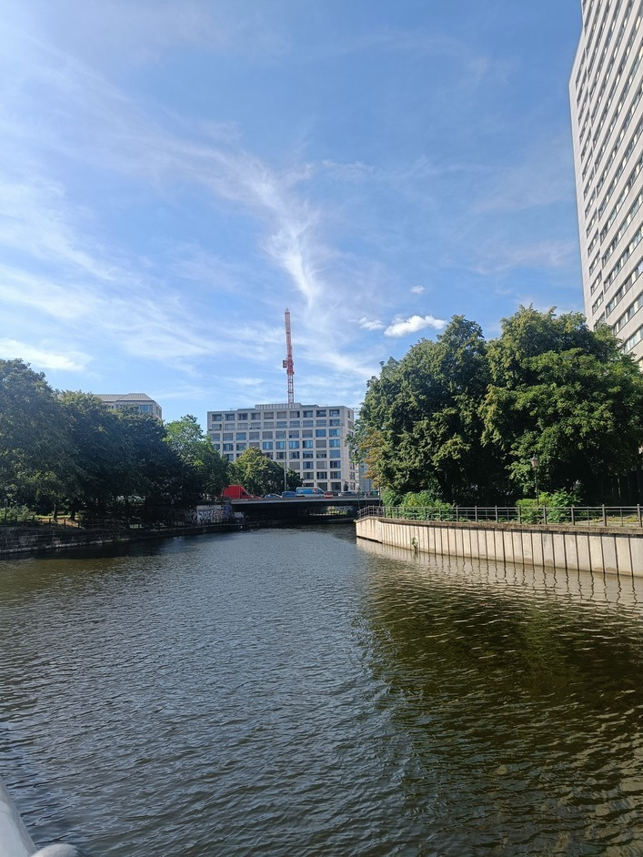
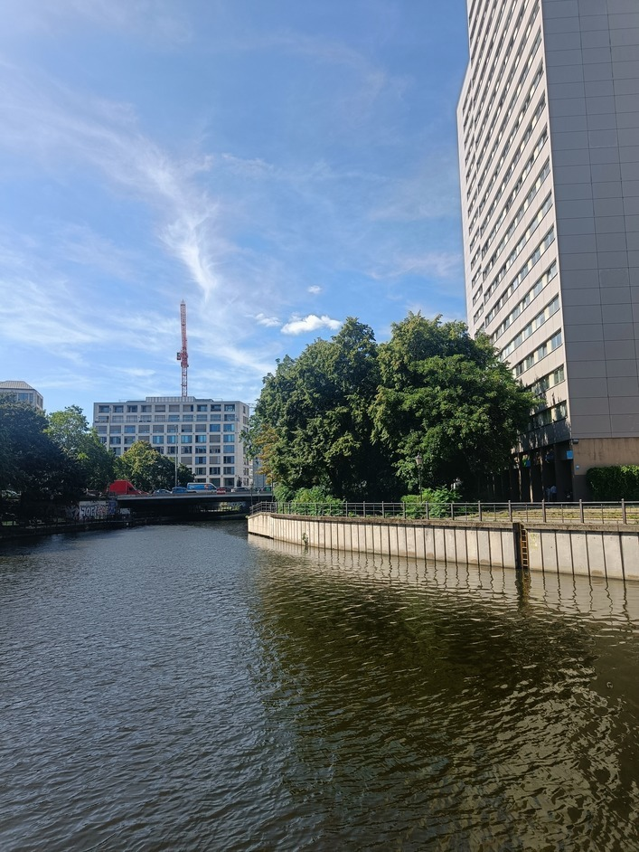
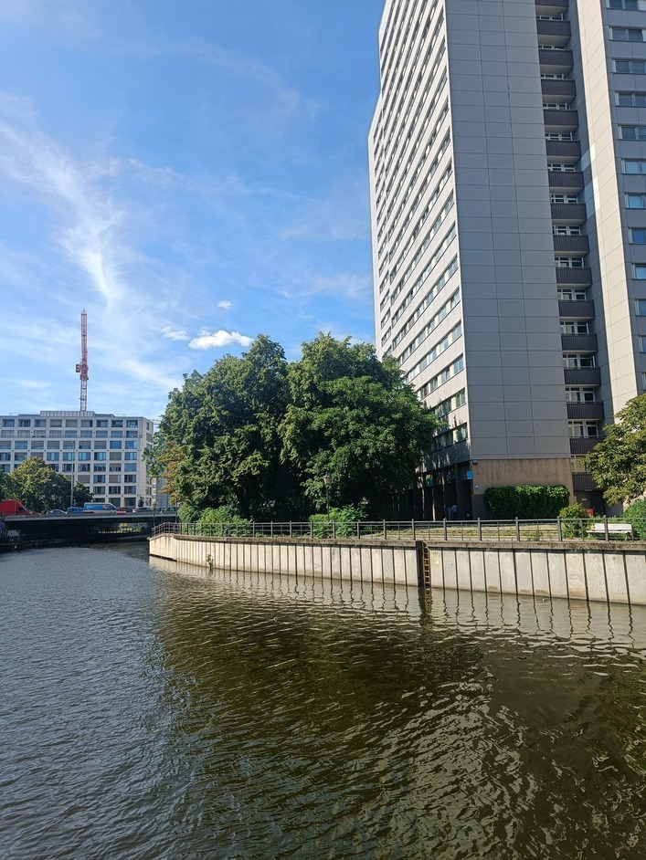
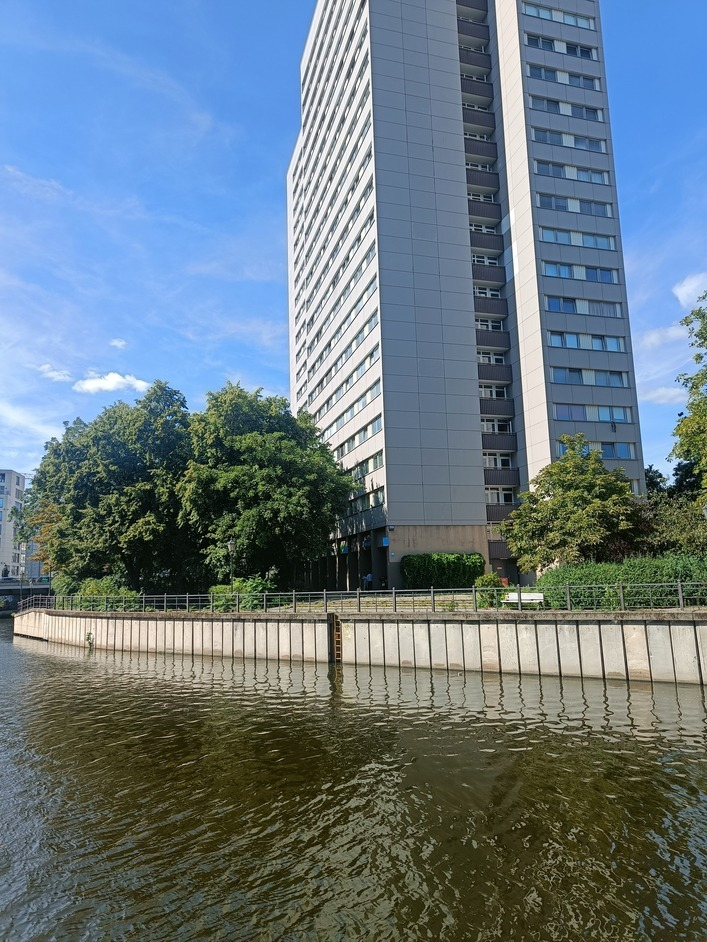
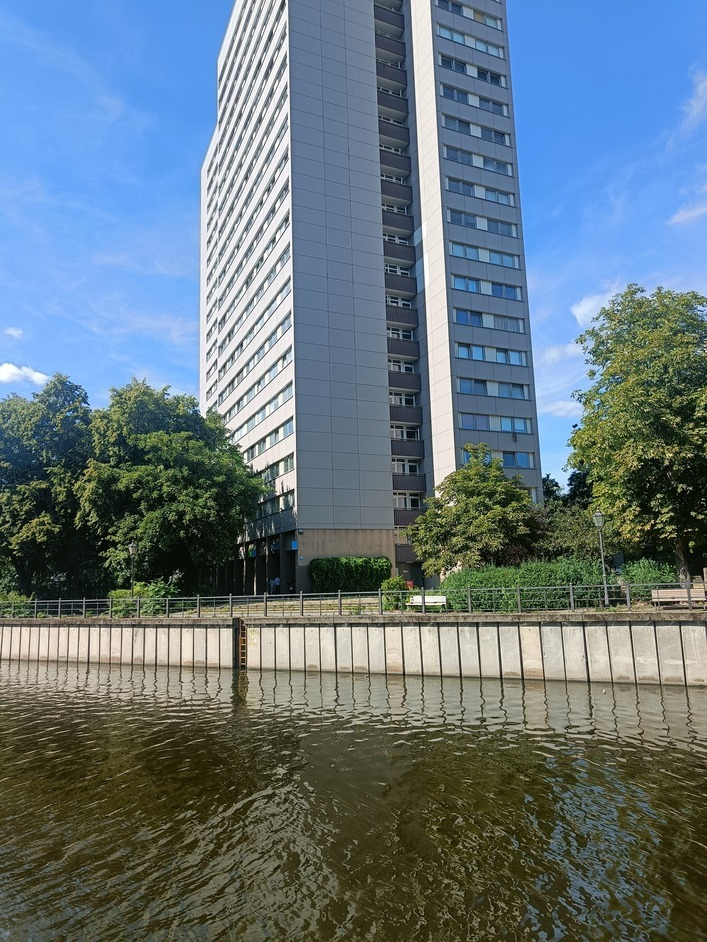
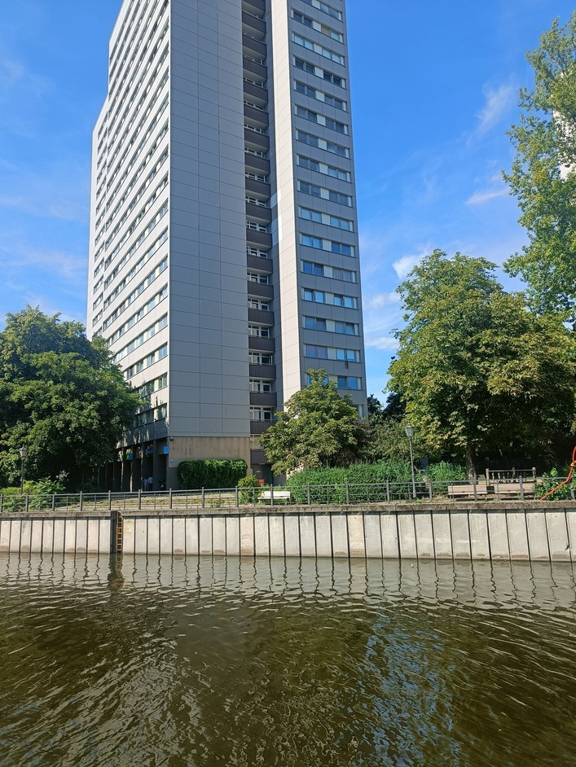

## Image Stitching

### Description:

#### Input Images
<p align="center">
  
   
    
   
    
   
    
</p> 

#### Output Image


### Algorithm:

- #### Feature Extraction
    - Detect features from all the images.
    - Compute descriptors for each keypoint

- #### Feature Matching
    - Match features between all the images using a k-d tree to find the k-nearest neighbors in feature space.
    - Use a distance metric to determine the similarity between two descriptors.
    - Use a ratio test to determine the best matches.

- #### Image Matching
    - Use RANSAC to estimate the homography between two images.
    - Use the homography to warp the images.
    - Blend the images together.
    - Probabilistic Model

- #### Panorama Recognition
    - Connected Components

- #### Image Alignment
    - Homography Estimation
    - RANSAC
    - Image Warping
    - Image Blending

- #### Rendering
    - Automatic Straightening
    - Gain Compensation
    - Multi-band Blending

### Psuedo Code:

```c++
// Pseudo-code outline for the image stitching algorithm

// Step 1: Feature Extraction
for (Image img : images) {
    SIFTFeatures features = extractSIFT(img);
    imageFeatures.push_back(features);
}

// Step 2: Feature Matching
std::vector<Match> matches;
for (int i = 0; i < images.size(); i++) {
    for (int j = i + 1; j < images.size(); j++) {
        matches.push_back(matchFeatures(imageFeatures[i], imageFeatures[j]));
    }
}

// Step 3: Image Matching
std::vector<ImagePair> imagePairs;
for (Match match : matches) {
    Homography H = estimateHomographyRANSAC(match);
    if (verifyMatch(H, match)) {
        imagePairs.push_back({match.image1, match.image2, H});
    }
}

// Step 4: Panorama Recognition
std::vector<Panorama> panoramas = findConnectedComponents(imagePairs);

// Step 5: Image Alignment
for (Panorama& pano : panoramas) {
    bundleAdjust(pano);
}

// Step 6: Rendering
for (Panorama& pano : panoramas) {
    straighten(pano);
    gainCompensation(pano);
    multiBandBlend(pano);
}

// Step 7: Output
for (Panorama& pano : panoramas) {
    savePanorama(pano);
}
```

### Diagram

### Paper:

[Automatic Panoramic Image Stitching using Invariant Features](https://www.cs.ubc.ca/~lowe/papers/07brown.pdf)

### Other Links:

- [OpenCV Image Stitching Description](https://docs.opencv.org/3.4/d1/d46/group__stitching.html)
- [PyImageSearch](https://pyimagesearch.com/2018/12/17/image-stitching-with-opencv-and-python/)